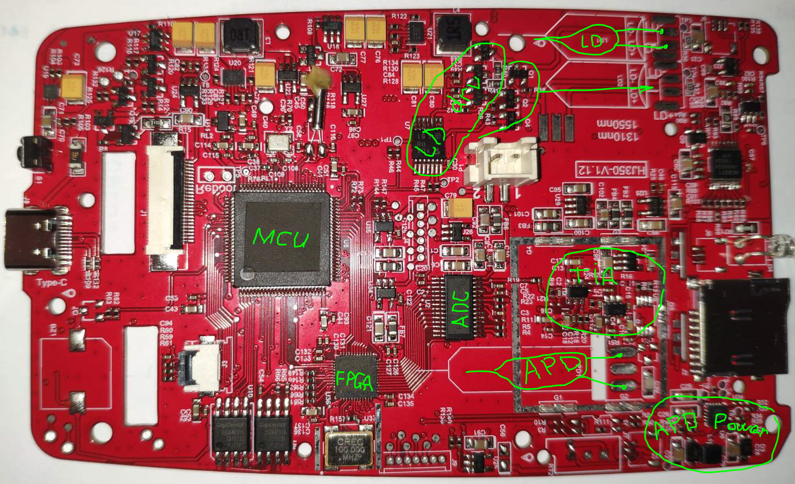

## Reverse engineering the cheapest OTDRs from China (Tynish TN1700).

Available on Aliexpress for around $100. 
https://www.google.com/search?q=TN1700+site%3Aaliexpress.com

#### APD(avalanche photodiode) power supply
https://www.sg-micro.com/product/SGM41282C 
https://www.sg-micro.com/rect/assets/7a6f5550-29b0-4f92-9198-7deb495df53e/SGM41282C.pdf 

#### TIA(transimpedance amplifier) & ADC amplifier
https://www.ti.com/lit/ds/symlink/opa657.pdf

#### ADC
Looks like TI ADS901 or THS1031.

#### FPGA
Looks like Gowin GW1N series.

#### MCU
Looks like an STM32 clone from GigaDevice.
